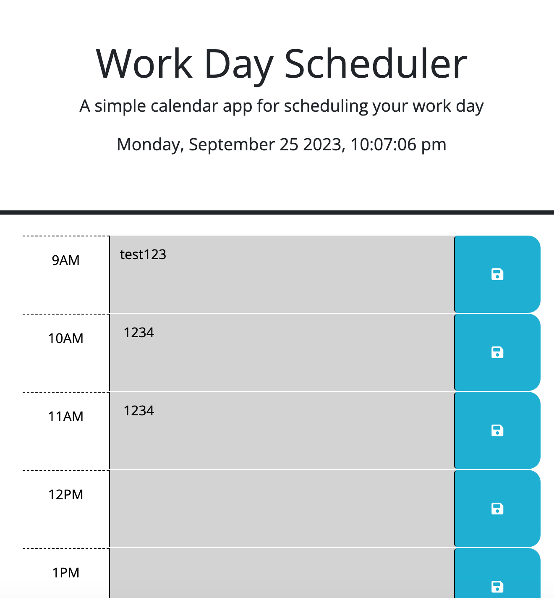

# 05 Third-Party APIs: Work Day Scheduler
A color coded schedule for your work day

# Description
This is a color coded schedule that allows you to take notes and save them for each specific time. The colors change based on if the time has passed or not

# Installation

This project can be downloaded (as a whole) and ran in Visual Studio Code with no additional modifications.

# Usage

https://m-r-urbanic.github.io/Day-Planner/

Grey boxes mean the hour has already passed, red means that is the current hour, green means that is a future hour. Type into any of the text boxes and click the save button next to it. That will save the text (for that box only) in the local storage.

# Credit

Apply Bootstrap CSS class to all HTML elements of given type, stackoverflow, https://stackoverflow.com/questions/38335944/apply-bootstrap-css-class-to-all-html-elements-of-given-type

jquery background color change on button click, stackoverflow, https://stackoverflow.com/questions/9821691/jquery-background-color-change-on-button-click

How do I make my javascript function change the color of my text?
, stackoverflow, https://stackoverflow.com/questions/63812620/how-do-i-make-my-javascript-function-change-the-color-of-my-text

day.js tutorial, ZetCone, https://zetcode.com/javascript/dayjs/

String + Format, Day.js, https://day.js.org/docs/en/parse/string-format
